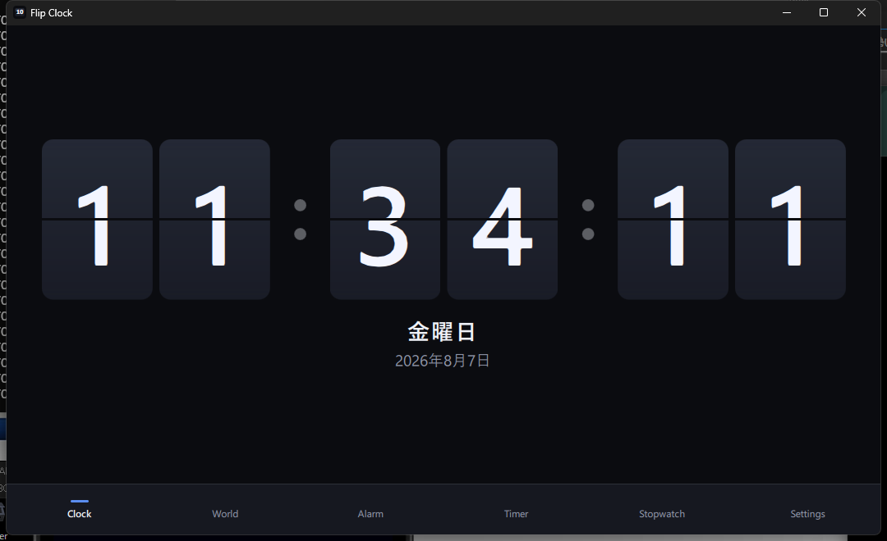
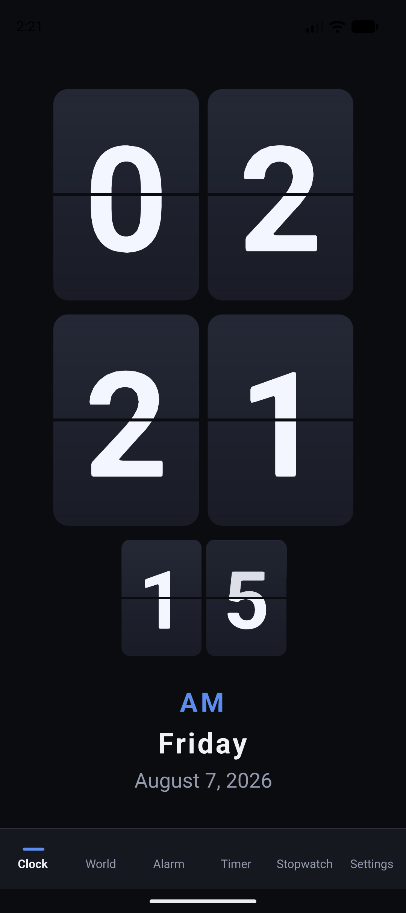

# Flip Clock

A split-flap clock for Windows and Android, built with Qt 6 / C++ and Qt Quick.

Full-screen flip clock, world clock, alarms, countdown timer and stopwatch, with
six colour themes and settings that persist across restarts.

<!-- Add once the repository exists on GitHub:
[](https://github.com/OWNER/REPO/actions/workflows/build.yml)
-->

| Windows | Android |
|---|---|
|  |  |

More: [world clock](docs/screenshots/android-world.png),
[timer in landscape](docs/screenshots/android-timer-landscape.png).

## Features

| | |
|---|---|
| **Clock** | Split-flap animation with per-digit flipping, 12/24-hour, weekday and date, seconds on/off. Landscape lays the fields out in a row; portrait stacks hours over minutes so the digits stay large. Tap to hide the navigation for an unobstructed display. |
| **World clock** | Any IANA time zone, searchable by city or region. Shows UTC offset, a DST marker, and a Tomorrow/Yesterday badge when the local date differs. Drag to reorder. |
| **Alarm** | Multiple alarms, per-weekday repeat or one-shot, label, snooze interval. A full-screen takeover rings with Snooze and Dismiss. See [Alarm limitations](#alarm-limitations). |
| **Timer** | Countdown with presets, pause/resume, +1 min, and a progress ring. |
| **Stopwatch** | 1/100 s resolution with laps, fastest and slowest highlighted. |
| **Appearance** | Six themes (Midnight, Charcoal, Amber, Neon, Paper, Ocean), digit font selection, split-flap / fade / no animation, keep-screen-on. |

## Repository layout

```
├── CMakeLists.txt          single target: sources, QML module, resources
├── CMakePresets.json       Windows and Android presets, Qt located via env vars
├── src/                    C++ backend
│   ├── app/                AppSettings, ScreenAwake
│   ├── theme/              ThemeManager
│   ├── clock/              ClockController, WorldClockModel, time zone helpers
│   ├── alarm/              Alarm, AlarmModel, AlarmScheduler
│   └── timing/             CountdownTimer, Stopwatch, LapModel
├── qml/                    Qt Quick UI, one directory per feature
│   ├── clock/  alarm/  timing/  settings/
│   └── common/             shared controls (NavBar, PillButton, …)
├── assets/                 generated alert tones and the app icon
├── android/                AndroidManifest.xml (QT_ANDROID_PACKAGE_SOURCE_DIR)
├── tools/                  build, capture and test scripts (PowerShell)
├── docs/screenshots/
└── .github/workflows/      CI for both platforms
```

The `.qml` files sit in per-feature subdirectories on disk but are flattened
into a single QML module namespace by `QT_RESOURCE_ALIAS` in `CMakeLists.txt`,
so every component is importable from every other one without extra imports.

## Requirements

- **Qt 6.9 or newer** — desktop kit (`msvc2022_64` on Windows) plus
  `android_arm64_v8a` and/or `android_x86_64` for Android.
  The only add-on module beyond a default install is **Qt Multimedia**;
  Quick, Qt Quick Controls, Qt Quick Shapes and Qt SVG all come with the base
  kit. 6.9 is the floor because `Main.qml` uses the QML `SafeArea` attached
  type, added in that release.
- **Windows**: Visual Studio 2022 or newer with the MSVC v143 x64 toolset.
- **Android**: SDK platform 35+, build-tools 35+, **NDK r27** (Qt 6.9–6.11 are
  built against it), and a **JDK between 17 and 21** — the Android Gradle
  Plugin fails on JDK 22+.
- CMake 3.21.1+ and Ninja. Both ship with the Qt installer under `Qt/Tools`,
  and the build scripts add them to `PATH` automatically.

Nothing above is hard-coded. `tools/common.ps1` discovers Qt, MSVC, the JDK and
the Android SDK/NDK, and exports the variables the presets read. Set any of
these beforehand to override the choice:

| Variable | Meaning |
|---|---|
| `QT_DIR_DESKTOP` | Full path to the desktop Qt kit |
| `QT_DIR_ANDROID_ARM64` / `QT_DIR_ANDROID_X86_64` | Full paths to the Android kits |
| `QT_VERSION_DIR` | Qt version directory (e.g. `C:\Qt\6.11.1`) to pick kits from |
| `QT_INSTALL_ROOT` | Where to look for Qt if it is not under `C:\Qt` |
| `ANDROID_SDK_ROOT` / `ANDROID_NDK_ROOT` / `JAVA_HOME` | Android toolchain |

## Building

### Windows

```bash
pwsh ./tools/build-windows.ps1 -Config debug -Run
```

The script imports the MSVC environment (Ninja will not find `cl.exe` on its
own), configures, builds, and optionally launches the app with the Qt kit's
`bin` on `PATH`.

By hand, from a Developer PowerShell with `QT_DIR_DESKTOP` set:

```bash
cmake --preset windows-msvc-release && cmake --build --preset windows-msvc-release
```

To produce a redistributable folder, run `windeployqt` against the built
executable, or `cmake --install` — the deploy script is generated for desktop
targets only.

### Android

```bash
pwsh ./tools/build-android.ps1 -Abi arm64 -Apk -Install
```

`-Abi` takes `arm64` (devices) or `x86_64` (emulator). `-Serial <id>` selects a
target when more than one is attached.

The Android presets build in **Debug** so `androiddeployqt` runs
`assembleDebug` and Gradle signs the APK with the debug keystore; a release
build comes out unsigned and `adb install` rejects it. Shipping a release build
means adding a signing configuration.

Minimum supported Android is **API 28**, which is Qt 6.9's own floor.

## Development tools

| Script | Purpose |
|---|---|
| `tools/common.ps1` | Toolchain discovery shared by the others. Defines functions only; dot-source it and call `Initialize-BuildEnv`. |
| `tools/build-windows.ps1` | Configure + build (+ run) the Windows target. |
| `tools/build-android.ps1` | Configure + build + package + install the Android target. |
| `tools/capture-window.ps1` | Launch the Windows app, screenshot only its own window, print any Qt warnings. `-Page` clicks a navigation entry first, `-ClickAt` drives arbitrary controls. |
| `tools/capture-android.ps1` | Same for a device or emulator, with `-Orientation` to check landscape. |
| `tools/test-alarm.ps1` | End-to-end alarm check: seeds an alarm a minute out, launches the app, and screenshots the ringing screen. |
| `tools/generate-sounds.ps1` | Regenerates `assets/sounds/*.wav`. The alert tones are synthesised rather than shipped as opaque binaries, so they carry no third-party licensing. |

## Architecture

Logic lives in C++; QML is presentation only. C++ types register themselves
through `QML_ELEMENT` / `QML_SINGLETON` and `qt_add_qml_module(... SOURCES ...)`
— there are no hand-written `qmlRegisterType` calls.

Notable decisions:

- **The tick re-arms for the exact remainder of the current second** rather
  than repeating every 1000 ms, which would drift visibly over an evening.
- **The C++ singletons never read `AppSettings` themselves.** `Main.qml` binds
  settings into them, so the dependency runs one way and each class stays
  testable on its own.
- **One card per character.** The seconds-units card flips every second while
  the hours-tens card sits idle for ten hours.
- **Both halves of a flip card render the whole card and clip it**, so the digit
  splits exactly on the fold line at any size with no font-metric guesswork.
- **The alarm scheduler arms a single timer**, capped at one hour, so the
  schedule self-corrects across DST transitions, time zone changes and suspend.
- **Elapsed time comes from `QElapsedTimer`,** never the wall clock: changing
  the system time mid-countdown cannot make a timer finish early.

## Alarm limitations

Alarms ring **only while the app is running.** There is no Android
`AlarmManager` integration, no foreground service and no boot receiver, so once
Android freezes or kills the process a pending alarm will not sound. The Alarm
page says so, and "Keep screen on" in Settings is the practical workaround for
leaving the clock up overnight.

Making alarms fire from a stopped process needs a Java/JNI layer around
`AlarmManager.setExactAndAllowWhileIdle`, a notification channel, a
`BOOT_COMPLETED` receiver and the `SCHEDULE_EXACT_ALARM` permission. That is a
deliberate omission, not an oversight.

On Windows the app must likewise be running; it does not install a scheduled
task.

## Licence

This project is MIT licensed — see [LICENSE](LICENSE).

The alert tones in `assets/sounds/` and the icon in `assets/icons/` are produced
by this repository's own scripts and source, and no third-party fonts are
bundled: the digit font is chosen from what the system already has.

Qt itself is not covered by that licence. Binaries built here link Qt
dynamically under the **LGPLv3**, which carries its own obligations when you
distribute them — notably that recipients must be able to relink against a
modified Qt. A commercial Qt licence is the alternative.
